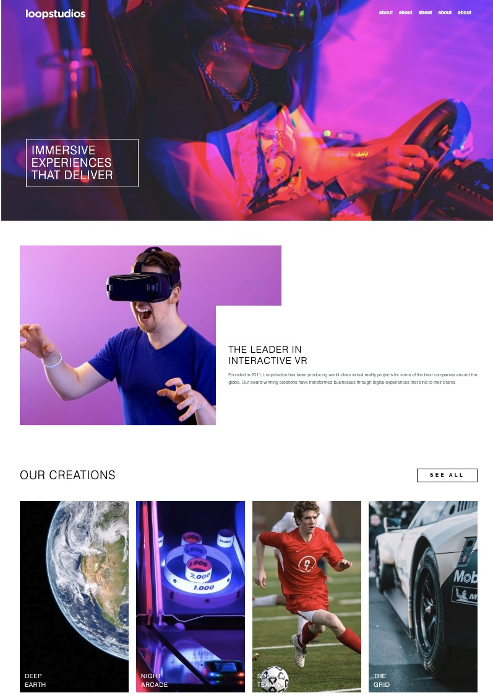

Loopstudios Landing Page
A visually engaging landing page project built with React and Tailwind CSS, inspired by modern VR studio aesthetics. This project features a responsive header (desktop and mobile layouts), dynamic content sections, a showcase of creations, and clean modular components.

Preview

LIVE: https://dzik0.github.io/loopstudios-landing/

Features
Responsive UI: Switches between desktop and mobile headers

Hero section with interactive imagery and brand story

Dynamic creations grid populated from a data file

Accessible, mobile-friendly layout with Tailwind CSS

Modular React component architecture

Tech Stack
React

Tailwind CSS

JavaScript

Vite (for fast local development and builds)

Getting Started
Prerequisites
Node.js (v16+ recommended)

Git

Installation
Clone the repository and install dependencies:

git clone https://github.com/Dzik0/loopstudios-landing.git
cd loopstudios-landing
npm install
Running Locally
Start the development server:

npm run dev
Open http://localhost:5173 to view the app in your browser.

Build
Build the production assets:

npm run build
Deployment
This project can be deployed to GitHub Pages using the gh-pages package.

Author
Created by Dzik0.
